# Learnings — Curso "Learn Harness Engineering" (walkinglabs)

- **Fuente**: [walkinglabs/learn-harness-engineering](https://github.com/walkinglabs/learn-harness-engineering), lecciones L01–L12 (`docs/en/lectures/*/index.md`), mirror local en `./harness-course/`.
- **Método**: 3 sub-agentes en paralelo (L01–04, L05–08, L09–12), mismo esquema por lección: *plantillas literales* (verbatim, sin parafrasear), *decisiones de diseño* con justificación y evidencia, *anti-patrones*.
- **Fecha**: 2026-07-02.
- **Destino**: gap-analysis de un harness de orquestador único + sub-agentes efímeros (GSD) en un repo Python/React desplegado en Cloud Run/GCP. El contenido es agnóstico de stack; la evidencia citada procede de los experimentos del curso.

## Mapa del curso

El curso organiza el harness en **cinco subsistemas** — instrucciones, estado, verificación, scope y ciclo de vida de sesión — y dedica dos lecciones a cada fase: ver el problema (L01–02), estructurar el repo (L03–04), conectar sesiones (L05–06), feedback y scope (L07–08), verificación (L09–10), y observabilidad + cierre (L11–12).

## Síntesis ejecutiva (las cifras que justifican cada mecanismo)

| Mecanismo | Evidencia del curso |
|---|---|
| Harness completo (planner + generator + evaluator) vs. prompt solo | Mismo modelo y tarea: $9/20 min → inservible; $200/6 h → jugable (experimento Anthropic, L01/L09) |
| Inicialización como fase propia (L06) | +31% completion rate multi-sesión; se amortiza en 3–4 sesiones |
| WIP=1 / una feature activa (L07) | +37% completion rate; correlación negativa LOC ↔ features completadas |
| Feature list estructurada (L08) | +45% completion rate y cero reimplementaciones vs. notas libres |
| Artefactos de continuidad (L05) | Rebuild cost al arrancar sesión: ~15 min → ~3 min |
| Progreso legible por máquina (L11/L12) | −60–80% tiempo de diagnóstico al arrancar sesión |
| Clean-state checklist al cerrar (L12) | ~5 min/sesión evitan −29 pts de build pass rate y +85% de tiempo de arranque a 12 semanas |

Las tres partes siguientes conservan el detalle completo por lección.

---

## Parte 1 — Lecciones L01–L04

Resumen estructurado de las lecciones 1–4. Las plantillas y citas se conservan verbatim en su inglés original; la prosa explicativa está en español. Documento agnóstico de stack, pensado para gap-analysis en otro repositorio.

---

## L01 — Strong Models Don't Mean Reliable Execution

### Plantillas literales

**1. Ejemplo de "Definition of Done" explícita** (sección "When Things Fail, Fix the Harness First"). Es la plantilla de criterios de finalización verificables por comando que la lección propone escribir para cada tarea en lugar de peticiones vagas:

```text
Completion criteria:
- New endpoint GET /api/search?q=xxx
- Supports pagination, default 20 items
- Results include highlighted snippets
- All new code passes pytest
- Type checking passes (mypy --strict)
```

No hay más plantillas reutilizables en esta lección (no incluye plantilla de `AGENTS.md`, estructura de directorios ni diagramas).

### Decisiones de diseño

1. **Ante un fallo, arreglar primero el harness, no cambiar de modelo.** Principio central de la lección: "When things fail, don't swap the model first — check the harness." Evidencia: experimento controlado de Anthropic — mismo prompt ("build a 2D retro game editor"), mismo modelo (Opus 4.5), dos ejecuciones: sin soporte, 20 minutos y $9 con las funciones centrales rotas; con harness completo (arquitectura de tres agentes planner/generator/evaluator), 6 horas y $200 con el juego totalmente jugable. También cita el artículo de harness engineering de OpenAI (2025): Codex en un repo bien "harnessed" pasa de "unreliable" a "reliable" — un salto cualitativo, no incremental.

2. **Atribuir cada fallo a una capa concreta de las cinco capas de defensa** (task specification, context provision, execution environment, verification feedback, state management), en lugar de concluir "el modelo no es lo bastante bueno". Justificación: los modos de fallo reales se reducen a un puñado identificable (requisitos vagos, convenciones implícitas no escritas, entorno incompleto, sin verificación, pérdida de estado entre sesiones); mantener un log simple de éxito/fallo + capa causante revela cuál es el cuello de botella.

3. **Escribir una Definition of Done verificable por comando para cada tarea.** Justificación: "Without an explicit definition of done, the agent will invent its own" — el "verification gap" (brecha entre la confianza del agente y la corrección real) es el modo de fallo más común. Anthropic observó además la "context anxiety": cuando el agente nota que se agota su contexto, se apresura, salta pasos de verificación y elige la solución simple sobre la óptima.

4. **Colocar un `AGENTS.md` en la raíz del repo** con stack tecnológico, convenciones arquitectónicas y comandos de verificación. La lección lo llama el primer paso de harness engineering y el de mayor ROI: "One `AGENTS.md` file might be more effective than upgrading to a more expensive model — and that's not a joke." Evidencia del ejemplo FastAPI (~15.000 líneas): con solo una frase de prompt, el agente gastó 40% del contexto explorando el repo, usó sintaxis antigua de SQLAlchemy y declaró completada una tarea con errores en runtime; tras añadir `AGENTS.md`, comandos de verificación explícitos (`pytest tests/api/v2/ && python -m mypy src/`) y ADRs, el mismo modelo tuvo éxito en 3 de 3 ejecuciones independientes con ~60% mejor eficiencia de contexto.

5. **Construir un bucle diagnóstico (Diagnostic Loop):** ejecutar, observar el fallo, atribuirlo a una capa del harness, arreglar esa capa, re-ejecutar. Justificación: cada fallo es señal de un defecto estructural del harness; tras varias rondas el harness se refuerza y el rendimiento se estabiliza. Evidencia: el experimento del millón de líneas de OpenAI — 3 ingenieros, 5 meses, ~1M líneas 100% generadas por Codex, 1.500 PRs (3,5/persona/día); cada bloqueo era siempre "what is the agent still missing, and can that missing capability be supplied in a way that is both understandable and executable?", nunca falta de esfuerzo del agente.

6. **Descomponer objetivos grandes en bloques pequeños** (design, code, review, test) y dejar que el agente los ensamble, componiendo después bloques más complejos. Evidencia: es el patrón que los 3 ingenieros de OpenAI descubrieron en el experimento del millón de líneas, tras un arranque sorprendentemente lento por falta de herramientas y estructuras.

### Anti-patrones

1. **"El modelo no es lo bastante bueno — pruebo uno más caro."**
   - Qué es: atribuir todo fallo a capacidad del modelo y responder cambiando/pagando un modelo superior.
   - Por qué falla: el experimento de Anthropic demuestra que el mismo modelo produce resultados radicalmente distintos según el harness ("Harness-Induced Failure": capacidad suficiente, entorno con defectos estructurales). Cambiar de modelo es "la opción más cara" y la mayoría de las veces no es un problema de modelo.
   - Alternativa: revisar sistemáticamente las cinco capas del harness y arreglar la defectuosa.

2. **Requisitos vagos ("Add a search feature").**
   - Por qué falla: el agente solo puede adivinar (¿full-text o consultas estructuradas? ¿paginación? ¿highlighting?); un acierto es suerte y un error cuesta varias veces más en retrabajo que especificar desde el inicio.
   - Alternativa: Definition of Done explícita y verificable por comando (plantilla de arriba).

3. **Convenciones implícitas no escritas** (p. ej. sintaxis SQLAlchemy 2.0, OAuth 2.0 obligatorio que solo existe "in your head and a Slack message from three months ago").
   - Por qué falla: "it's not that it doesn't want to comply, it literally has never seen the rule."
   - Alternativa: escribirlas en `AGENTS.md`.

4. **Entorno de desarrollo incompleto** (dependencias faltantes, versiones incorrectas).
   - Por qué falla: el agente quema contexto valioso en errores de `pip install` y conflictos de versiones de Node en lugar de la tarea real.
   - Alternativa: entorno completo y reproducible como parte del harness.

5. **Ausencia de métodos de verificación.**
   - Por qué falla: "The agent writes code, looks it over, decides it seems fine, and declares completion" — verification gap; agravado por la "context anxiety" observada por Anthropic.
   - Alternativa: comandos de verificación explícitos comunicados al agente (tests, lint, type-check).

6. **Pérdida de estado entre sesiones.**
   - Por qué falla: cada sesión nueva re-explora la estructura del proyecto desde cero; "Agents without persistent state see failure rates spike sharply on tasks exceeding 30 minutes."
   - Alternativa: estado persistente (gestión de estado como una de las cinco capas; se desarrolla en L02/L03).

---

## L02 — What a Harness Actually Is

### Plantillas literales

**1. Diagrama del modelo de cinco subsistemas del harness** (mermaid, sección "The Five-Subsystem Harness Model") — codifica el flujo instrucciones/estado → agente → herramientas → entorno → verificación → feedback al agente:

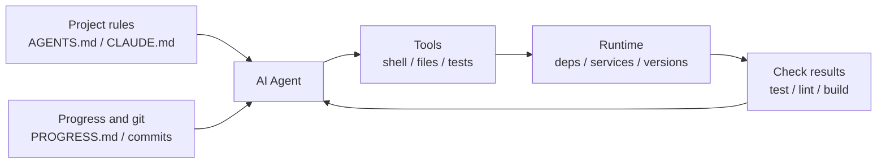

**2. Bloque de comandos de verificación para `AGENTS.md`** (sección "The Five-Subsystem Harness Model", subsistema de feedback):

```text
Verification commands:
- Tests: pytest tests/ -x
- Type check: mypy src/ --strict
- Lint: ruff check src/
- Full verification: make check (includes all above)
```

### Decisiones de diseño

1. **Definir el harness como cinco subsistemas: instrucciones, herramientas, entorno, estado y feedback** — "If it is not model weights, it is harness." Justificación: falta cualquiera de los cinco y el harness está incompleto ("the agent will always feel awkward to use"). Evidencia: comparación de herramientas reales — Claude Code (lee `CLAUDE.md`, ejecuta shell, mantiene historial), Cursor (`.cursorrules` como instrucciones pero estado débil: al cerrar el IDE se pierde el contexto), Codex (git worktrees para aislar entornos + stack de observabilidad; rinde mucho mejor en repos con `AGENTS.md` que en repos "bare"), y AutoGPT como caso negativo.

2. **"The repo IS the spec" / el repo como única fuente de verdad.** "Anything the agent cannot see, for all practical purposes, does not exist." Justificación: el agente, a diferencia de un ingeniero nuevo, no puede preguntar a un colega; solo ve los ficheros y la salida de comandos. OpenAI (repo como "system of record") y Anthropic (persistencia de estado, rutas de recuperación explícitas, tracking estructurado de progreso) convergen en lo mismo.

3. **"Give a map, not a manual":** `AGENTS.md` debe ser una página-directorio, no una enciclopedia. Evidencia citada: experiencia de OpenAI — "Around 100 lines is enough. If it does not fit, split it into a `docs/` directory and let the agent read on demand."

4. **"Constrain, don't micromanage":** reglas ejecutables que restringen, no enumeración de instrucciones. Evidencia: OpenAI — "enforce invariants, don't micromanage implementation"; Anthropic descubrió que los agentes alaban con confianza su propio trabajo, y la solución es separar "the person who does the work" de "the person who checks the work".

5. **Priorizar el subsistema de feedback: es el de mayor ROI.** "Among the five subsystems, the feedback subsystem usually has the lowest investment and highest return. Get your verification commands right first." Evidencia: historia del equipo GPT-4o + TypeScript/React (~20.000 líneas), cuatro etapas incrementales: solo README → 20% de éxito (1/5); + `AGENTS.md` con versiones, naming y decisiones de arquitectura → 60%; + comandos de verificación (`yarn test && yarn lint && yarn build`) → 80%; + plantillas de fichero de progreso → 80–100% estable. "Four iterations, the model did not change at all, and success rate went from 20% to near 100%."

6. **Cuantificar el valor de cada componente con tests de exclusión de variable controlada** ("remove one at a time and observe"): modelo fijo, quitar un subsistema cada vez y medir la caída de rendimiento. Matiz que la propia lección subraya: la ablación responde "qué componente es más valioso ahora", pero no basta para localizar el cuello de botella — para eso hacen falta registros de fallos y atribución de causa raíz; componentes con impacto ~0 pueden ser redundantes, estar mal diseñados o simplemente no ejercitarse en la tarea actual. Evidencia: Anthropic usó este método y descubrió que al fortalecerse los modelos algunos componentes dejan de ser críticos, pero siempre emergen nuevos componentes críticos.

7. **Herramientas con mínimo privilegio pero suficientes:** no deshabilitar el shell "por seguridad" ("if the agent cannot even run `pip install`, how is it supposed to get anything done?"), pero tampoco abrirlo todo.

8. **Entorno auto-descriptivo y reproducible:** dependencias fijadas (`pyproject.toml`/`package.json`), versiones de runtime declaradas (`.nvmrc`/`.python-version`), Docker o devcontainers.

9. **Tracking de progreso para tareas largas:** un `PROGRESS.md` simple con hecho / en curso / bloqueado; actualizar al final de cada sesión, leer al inicio de la siguiente.

10. **Auditar el harness regularmente:** "Harness rots like code does. Audit regularly, and pay down harness debt just like you pay down technical debt."

### Anti-patrones

1. **Equiparar "harness" con un fichero de prompt.**
   - Qué es: creer que tener un fichero de instrucciones es tener un harness ("A prompt file is not a harness").
   - Por qué falla: ignora los otros cuatro subsistemas (herramientas, entorno, estado, feedback).
   - Alternativa: el modelo de cinco subsistemas completo.

2. **El patrón AutoGPT: sin gestión estructurada de estado ni feedback preciso.**
   - Por qué falla: el contexto se acumula sin límite en tareas largas y el agente entra en bucles. "Many people say AutoGPT 'doesn't work,' but really it is the harness that does not work."
   - Alternativa: estado estructurado y mecanismos de feedback precisos.

3. **Estado efímero ligado a la sesión del IDE** (ejemplo: Cursor — "close the IDE and reopen it, and the previous context is gone").
   - Alternativa: persistir estado en ficheros del repo.

4. **Deshabilitar herramientas por exceso de precaución.**
   - Por qué falla: el agente no puede completar tareas básicas.
   - Alternativa: principio de mínimo privilegio, no privilegio cero.

5. **Dejar que el agente verifique/alabe su propio trabajo.**
   - Por qué falla: Anthropic observó que "agents confidently praise their own work".
   - Alternativa: separar quien hace el trabajo de quien lo verifica; imponer invariantes ejecutables.

6. **Descartar (o consagrar) componentes solo por resultados de ablación.**
   - Por qué falla: la ablación por sí sola no prueba dónde está el cuello de botella; un componente con impacto nulo puede ser redundante, estar mal diseñado o no ejercitarse.
   - Alternativa: combinar ablación con registros de fallo y atribución de causa raíz.

---

## L03 — Making the Repository the Single Source of Truth

### Plantillas literales

**1. Diagrama de visibilidad del conocimiento** (mermaid, sección "Knowledge Visibility") — flujo de externalización de reglas desde Slack/Confluence/cabezas/Jira hacia ficheros del repo:

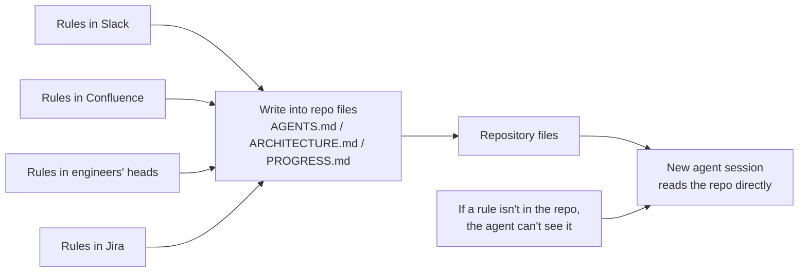

**2. Diagrama/checklist del "fresh session test"** (mermaid, sección "Knowledge Visibility") — las 5 preguntas y qué fichero debe responder cada una:

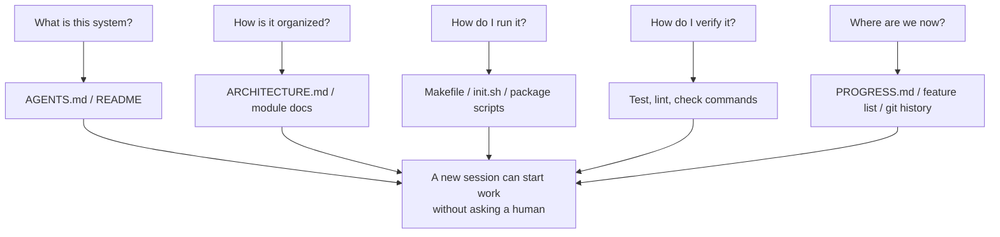

**3. Estructura de repositorio recomendada** (sección "How to Draw a Good Map"):

```text
project/
├── AGENTS.md              # Entry: project overview, run commands, hard constraints
├── src/
│   ├── api/
│   │   ├── ARCHITECTURE.md  # API layer architecture decisions
│   │   └── ...
│   ├── db/
│   │   ├── CONSTRAINTS.md   # Database operation hard constraints
│   │   └── ...
│   └── ...
├── PROGRESS.md             # Current progress: done, in-progress, blocked
└── Makefile                # Standardized commands: setup, test, lint, check
```

### Decisiones de diseño

1. **El repositorio como "system of record": lo que no está en el repo no existe para el agente.** Justificación: el agente tiene exactamente tres fuentes de input — system prompts/descripciones de tarea, contenidos de ficheros del repo, y salida de herramientas; no puede preguntar a nadie ni buscar en Slack/Jira/Confluence. Evidencia: principio "repo as spec" de OpenAI ("information that doesn't exist in the repo, doesn't exist for the agent") y la documentación de Anthropic sobre agentes de larga duración (el estado persistente es condición necesaria; la recuperabilidad de conocimiento entre sesiones determina directamente la tasa de éxito).

2. **Proximidad sobre longitud: el conocimiento vive junto al código.** "A 50-line `ARCHITECTURE.md` sitting in the `src/api/` directory is far more useful than a 500-page design document in Confluence that nobody maintains." Justificación: el directorio del módulo es un índice natural — al llegar al código, el agente llega a las restricciones sin buscar.

3. **Fichero de entrada estandarizado (`AGENTS.md`/`CLAUDE.md`) de 50–100 líneas** que responda: qué es el proyecto, cómo se ejecuta, cómo se verifica. Es la "landing page" del agente; no necesita contener toda la información.

4. **Mínimo pero completo:** cada pieza de conocimiento debe tener un caso de uso claro ("If removing a rule doesn't affect the agent's decision quality, that rule shouldn't exist"), pero toda pregunta del fresh session test debe tener respuesta.

5. **Actualizar conocimiento junto con el código:** colocar docs de arquitectura en el directorio del módulo (al modificar código se ve el doc); CI puede recordar revisar los docs tras cambios. Justificación: el "knowledge decay" es el mayor enemigo — "worse than no documentation at all is documentation that's out of date" (manda al agente en la dirección equivocada mientras cree ir bien).

6. **Usar el "fresh session test" como métrica de calidad del repo:** sesión nueva, solo contenidos del repo, cinco preguntas (qué es el sistema, cómo se organiza, cómo se ejecuta, cómo se verifica, dónde estamos). Justificación: donde el mapa tiene huecos el agente adivina; "The cost of guessing is always far higher than the cost of drawing the map properly in the first place", y cada sesión nueva vuelve a adivinar.

7. **Gestionar el estado del agente con principios ACID:**
   - *Atomicity*: una operación lógica = un commit git; si falla a medias, `git stash` para revertir — nada de "half done".
   - *Consistency*: predicados de verificación de "estado consistente" (tests en verde, lint sin errores); no commitear estados intermedios inconsistentes.
   - *Isolation*: con agentes concurrentes, evitar condiciones de carrera — fichero de progreso por agente o ramas git.
   - *Durability*: el conocimiento crítico vive en ficheros trackeados por git; "What's in your head doesn't count — only what's written down counts."

8. **Minimizar el "Discovery Cost":** la información crítica debe estar donde el agente la vea primero, "not buried ten directory levels deep", porque cada búsqueda quema presupuesto de contexto que ya no queda para la tarea.

9. **Restricciones duras con lenguaje explícito "MUST / MUST NOT"** en un `CONSTRAINTS.md`. Evidencia: transformación del equipo de e-commerce (~30 microservicios) — antes, 70% de las tareas requerían intervención humana y casi todo fallo era violar una restricción implícita que "everyone knows but nobody ever wrote down"; tras crear `AGENTS.md` raíz + `ARCHITECTURE.md` por servicio + `CONSTRAINTS.md` centralizado + `PROGRESS.md` por servicio, el mismo agente respondía todas las preguntas clave en sesión nueva y la calidad de finalización mejoró significativamente.

### Anti-patrones

1. **Conocimiento disperso fuera del repo** (Confluence, Slack, Jira, cabezas de ingenieros senior).
   - Por qué falla: para el agente esa información no existe; el "Knowledge Visibility Gap" (proporción de conocimiento del proyecto que NO está en el repo) correlaciona con la tasa de fallo. Evidencia: el caso de los 30 microservicios (70% de tareas con intervención humana).
   - Alternativa: escribir las reglas en ficheros del repo (`AGENTS.md`, `ARCHITECTURE.md`, `CONSTRAINTS.md`, `PROGRESS.md`).

2. **El documento gigante centralizado que nadie mantiene** ("a 500-page design document in Confluence").
   - Por qué falla: la información solo es útil si está a mano cuando se necesita; los documentos lejanos se desactualizan.
   - Alternativa: docs cortos por módulo, junto al código (principio de proximidad).

3. **Documentación desactualizada.**
   - Por qué falla: "worse than no documentation at all is documentation that's out of date" — dirige al agente por el camino equivocado con apariencia de corrección.
   - Alternativa: vincular actualización de docs a cambios de código (co-ubicación + recordatorios de CI); vigilar el "Knowledge Decay Rate".

4. **Información crítica enterrada / alto discovery cost.**
   - Por qué falla: el agente quema contexto buscándola y le queda menos para la tarea.
   - Alternativa: colocarla donde se vea primero (fichero de entrada, directorio del módulo).

5. **Estados intermedios sin garantías transaccionales** (trabajo "a medias" sin commit atómico, escrituras concurrentes al mismo fichero de estado, conocimiento solo en memoria de sesión).
   - Por qué falla: estados "half done" irrecuperables, condiciones de carrera entre agentes ("Concurrent writes to the same file are a common source of trouble"), pérdida de conocimiento entre sesiones.
   - Alternativa: el marco ACID (commits atómicos, verificación de consistencia, aislamiento por fichero/rama, durabilidad en ficheros git-tracked).

---

## L04 — Split Instructions Across Files

### Plantillas literales

**1. Diagrama comparativo de arquitectura de instrucciones** (mermaid, sección "Instruction Architecture") — fichero monolítico vs. entry file corto tipo router:

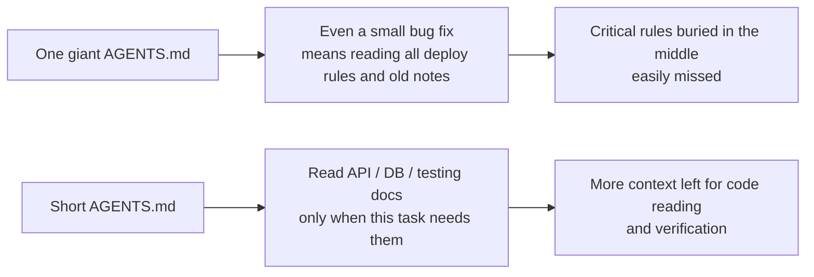

**2. Diagrama del efecto "lost in the middle"** (mermaid, sección "Instruction Architecture") — probabilidad de recall según posición en el fichero:

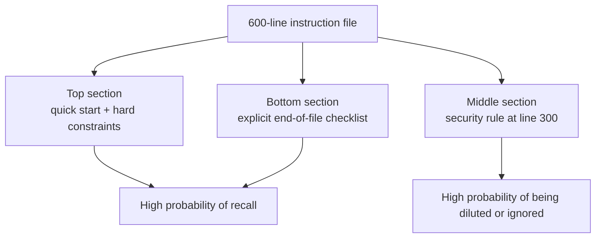

**3. Plantilla de `AGENTS.md` como entry file/router** (sección "How to Split"):

```markdown
# AGENTS.md

## Project Overview
Python 3.11 FastAPI backend, PostgreSQL 15 database.

## Quick Start
- Install: `make setup`
- Test: `make test`
- Full verification: `make check`

## Hard Constraints
- All APIs must use OAuth 2.0 authentication
- All database queries must use SQLAlchemy 2.0 syntax
- All PRs must pass pytest + mypy --strict + ruff check

## Topic Docs
- API Design Patterns (`docs/api-patterns.md`) — Required reading when adding endpoints
- Database Rules (`docs/database-rules.md`) — Required when modifying database operations
- Testing Standards (`docs/testing-standards.md`) — Reference when writing tests
```

### Decisiones de diseño

1. **El fichero de entrada es un router, no una enciclopedia: 50–200 líneas.** Contenido: overview del proyecto (una o dos frases), comandos de primer uso, restricciones duras globales ("no more than 15 non-negotiable rules"), y enlaces a documentos temáticos con descripción de una línea + condición de aplicabilidad. Evidencia: ambos proveedores lo respaldan — OpenAI dice que los entry files deben ser "short and routing-oriented"; Anthropic, que la información de control para agentes de larga duración debe ser "concise and high-priority".

2. **Documentos temáticos de 50–150 líneas, cargados bajo demanda ("Reveal on Demand"),** organizados por tema en `docs/` o junto al módulo correspondiente. Justificación: principio "keep frequently-needed information at hand, tuck away occasionally-needed information, and don't carry what you'll never use"; analogía de los packing cubes. Evidencia: caso real del equipo SaaS — `AGENTS.md` de 600 líneas partido en entry de 80 líneas + `docs/api-patterns.md` (120), `docs/database-rules.md` (60), `docs/testing-standards.md` (80); la tasa de éxito en el mismo conjunto de tareas subió del 45% al 72%.

3. **Explotar el efecto "lost in the middle": lo crítico arriba o abajo del fichero, nunca en medio.** Evidencia: el paper "Lost in the Middle" (Liu et al., 2023) demuestra que los LLMs utilizan la información del medio de textos largos significativamente peor que la de los extremos. En el caso SaaS, el cumplimiento de la restricción de seguridad ("all database queries must use parameterized queries", antes en la línea 300) subió del 60% al 95% al moverla al principio del entry file. Aun así, la lección dice que la mejor opción es mover instrucciones a topic docs bajo demanda.

4. **Poner cierta información directamente en el código** (definiciones de tipos, comentarios de interfaz, explicaciones en config): el agente la ve de forma natural al leer código, sin duplicarla en instrucciones.

5. **Metadatos por instrucción y auditoría regular:** cada instrucción debe documentar su origen ("why was this rule added?"), condición de aplicabilidad ("when is this rule needed?") y condición de expiración ("under what circumstances can this rule be removed?"). "Manage your instructions the way you manage code dependencies — unused dependencies should be removed." Justificación: sin esto, el fichero solo crece (borrar da miedo, añadir parece gratis) y el SNR cae — misma dinámica que la deuda técnica.

6. **Vigilar el presupuesto de contexto de las instrucciones.** Evidencia cuantitativa de la lección: un fichero de instrucciones que ocupa 10–15% de la ventana de contexto empieza a desplazar el presupuesto de lectura de código y razonamiento; un `AGENTS.md` de 600 líneas puede consumir 10.000–20.000 tokens (8–15% de una ventana de 128K).

7. **Convertir lecciones históricas en tests o eliminarlas.** En la refactorización del caso SaaS: "Historical notes either converted to test cases or deleted outright" — las notas de bugs pasados no pertenecen al fichero de instrucciones.

### Anti-patrones

1. **El fichero de instrucciones gigante (giant instruction file).**
   - Qué es: un único `AGENTS.md` que crece sin control (50 → 300 → 450 → 600 líneas) mezclando versiones de stack, estándares de código, notas históricas de bugs, guías de API, procedimientos de deploy y preferencias personales.
   - Por qué falla: consume presupuesto de contexto, entierra reglas críticas en el medio (lost in the middle), baja el SNR ("You wrote 600 lines, but only a third of it is relevant to the task at hand"), y degrada el rendimiento del agente. Evidencia: caso SaaS con 45% de éxito y 60% de cumplimiento de la restricción de seguridad antes del split.
   - Alternativa: entry file de 50–200 líneas + documentos temáticos bajo demanda.

2. **El ciclo vicioso "add a rule".**
   - Qué es: cada vez que el agente falla, añadir una regla más al fichero. "This is a perfectly natural reaction… But the cumulative effect is disastrous." / "'Add a rule' is short-term pain relief and long-term poison."
   - Por qué falla: funciona temporalmente pero infla el fichero hasta el descontrol.
   - Alternativa: antes de añadir una regla, valorar si pertenece a un documento temático; convertir lecciones puntuales en tests.

3. **Mezclar niveles de prioridad sin señal ("Can't Tell What Matters").**
   - Qué es: restricciones duras innegociables ("never use eval()"), guías de diseño ("prefer functional style") y lecciones históricas puntuales ("fixed a WebSocket memory leak last week…") con formato idéntico.
   - Por qué falla: el agente no tiene señal fiable para distinguir línea roja de sugerencia.
   - Alternativa: sección explícita de Hard Constraints (≤15 reglas) en el entry file; lo demás a topic docs o tests.

4. **Instrucciones que solo se añaden y nunca se borran (maintenance decay).**
   - Por qué falla: borrar tiene consecuencias inciertas ("maybe something else depends on this rule?") mientras añadir parece gratis; el SNR decae continuamente — igual que la deuda técnica.
   - Alternativa: auditoría regular; cada instrucción con origen, condición de aplicabilidad y condición de expiración.

5. **Acumulación de contradicciones.**
   - Qué es: instrucciones añadidas en momentos distintos que se contradicen (p. ej. "use TypeScript strict mode" vs. "some legacy files are allowed to use any").
   - Por qué falla: "The agent picks one at random each time."
   - Alternativa: auditar y eliminar entradas obsoletas, redundantes o contradictorias.

6. **Colocar restricciones críticas en el medio de ficheros largos.**
   - Por qué falla: efecto lost in the middle (Liu et al., 2023) — "A critical constraint buried at line 300 of a 600-line file has a very high probability of being ignored."
   - Alternativa: extremos del fichero (arriba o abajo) o, mejor, topic docs bajo demanda; evidencia del salto de 60% → 95% de cumplimiento.

---

## Síntesis L01-L04

- **Ante un fallo del agente, diagnostica el harness antes de cambiar de modelo:** atribuye cada fallo a una de las cinco capas (especificación de tarea, contexto, entorno, verificación, estado) y mantén un log de atribuciones para localizar el cuello de botella; cambiar de modelo es la opción más cara y rara vez la correcta.
- **Harness = 5 subsistemas (instrucciones, herramientas, entorno, estado, feedback);** un fichero de prompt solo no es un harness. El subsistema de feedback (comandos de verificación explícitos: test, lint, type-check, `make check`) es el de menor inversión y mayor retorno — configúralo primero.
- **Escribe una Definition of Done verificable por comando para cada tarea** en lugar de peticiones vagas; sin ella el agente inventa la suya y declara "done" sin estarlo (verification gap).
- **El repo es el system of record:** lo que no está en ficheros del repo no existe para el agente. Externaliza reglas de Slack/Confluence/cabezas a `AGENTS.md`, `ARCHITECTURE.md`/`CONSTRAINTS.md` por módulo y `PROGRESS.md`, con conocimiento junto al código, mínimo pero completo, y actualizado con el código (doc desactualizado es peor que ningún doc).
- **Valida el repo con el "fresh session test":** una sesión nueva, solo con el repo, debe poder responder qué es el sistema, cómo se organiza, cómo se ejecuta, cómo se verifica y dónde está el progreso.
- **El entry file (`AGENTS.md`) es un router de 50–200 líneas:** overview, comandos de arranque, ≤15 hard constraints y enlaces a topic docs de 50–150 líneas con condición de aplicabilidad, cargados bajo demanda; lo crítico arriba o abajo, nunca en el medio (lost in the middle).
- **Gestiona instrucciones como deuda técnica:** cada regla con origen, condición de aplicabilidad y de expiración; auditorías regulares; lecciones históricas convertidas en tests o eliminadas; evita el ciclo vicioso "add a rule".
- **Gestiona el estado con principios ACID:** commits atómicos por operación lógica, verificación de consistencia antes de commitear, aislamiento entre agentes concurrentes (fichero de progreso o rama por agente) y durabilidad del conocimiento crítico en ficheros trackeados por git.

---

## Parte 2 — Lecciones L05–L08

Resumen estructurado de las lecciones 5–8 del curso "learn-harness-engineering". Prosa en español; plantillas y citas verbatim en su inglés original. Fuentes:

- L05: `docs/en/lectures/lecture-05-why-long-running-tasks-lose-continuity/index.md`
- L06: `docs/en/lectures/lecture-06-why-initialization-needs-its-own-phase/index.md`
- L07: `docs/en/lectures/lecture-07-why-agents-overreach-and-under-finish/index.md`
- L08: `docs/en/lectures/lecture-08-why-feature-lists-are-harness-primitives/index.md`

---

## L05 — Keeping Context Alive Across Sessions

### Plantillas literales

**1. Diagrama de flujo "sin persistencia de estado" (sección "Session Continuity Flow"): qué pasa cuando cada sesión arranca de cero.**

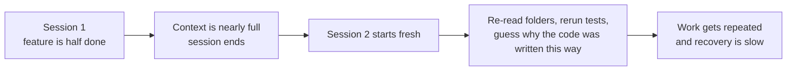

**2. Diagrama de flujo "con persistencia de estado" (sección "Session Continuity Flow"): los cuatro artefactos que alimentan el rebuild de la sesión siguiente.**

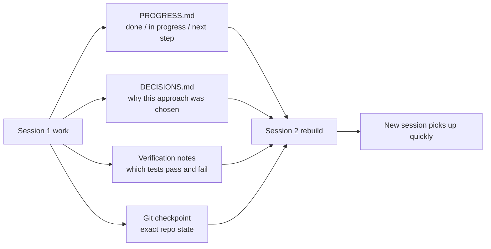

**3. Plantilla de fichero de progreso `PROGRESS.md` (sección "Practical Approaches to State Persistence", Tool 1).**

```markdown
# Project Progress

## Current State
- Latest commit: abc1234 (feat: add user preferences endpoint)
- Test status: 42/43 passing (test_pagination_edge_case failing)
- Lint: passing

## Completed
- [x] User model and database migration
- [x] Basic CRUD endpoints
- [x] Auth middleware integration

## In Progress
- [ ] Pagination feature (90% - edge case test failing)

## Known Issues
- test_pagination_edge_case returns 500 on empty result sets
- Need to confirm whether deleted users should appear in listings

## Next Steps
1. Fix pagination edge case bug
2. Add "include deleted users" query parameter
3. Update API documentation
```

**4. Plantilla de log de decisiones `DECISIONS.md` (misma sección, Tool 2): formato "what decision, why, when".**

```markdown
# Design Decisions

## 2024-01-15: Use Redis for user preferences caching
- Reason: High read frequency (every API call), small data size
- Rejected alternative: PostgreSQL materialized view (high change frequency makes maintenance cost not worthwhile)
- Constraint: Cache TTL of 5 minutes, active invalidation on write
```

**5. Rutina de "clock in / clock out" para incluir en `AGENTS.md` (misma sección, Tool 4, junto a `init.sh` o el flujo de inicialización del harness).**

```markdown
## At session start (clock in)
1. Read PROGRESS.md for current state
2. Read DECISIONS.md for important decisions
3. Run make check to confirm repo is in consistent state
4. Continue from PROGRESS.md "Next Steps" section

## Before session end (clock out)
1. Update PROGRESS.md
2. Run make check to confirm consistent state
3. Commit all completed work
```

### Decisiones de diseño

- **Persistir estado en ficheros estructurados en lugar de confiar en la ventana de contexto o en la compactación.** Justificación: las ventanas son finitas y la información crece más rápido que su expansión; la compactación conserva el "what" (el código) pero pierde el "why" (por qué se eligió la opción A sobre la B), y la siguiente sesión puede "optimizar" decisiones deliberadas. Evidencia: el caso del blog con 12 features en 5 sesiones — sin persistencia, 7/12 features completadas (58%) con 3 defectos ocultos (43%); con persistencia, 12/12 completadas y verificadas, defectos ocultos al 8%, y rebuild reducido ~78% (de ~15 min a ~3 min).
- **Modelo mental: "Treat the agent like an engineer whose short-term memory gets wiped at every session"** — antes de "fichar la salida" debe dejar por escrito lo hecho, el porqué y el siguiente paso. Justificación: cada frontera de sesión introduce drift (brecha entre el entendimiento del agente y el estado real del repo) que se compone sesión tras sesión si no se controla.
- **Cuatro herramientas complementarias**: progress file, decision log, git commits como checkpoints ("free, automatically versioned state snapshots") y rutinas de clock-in/clock-out en `AGENTS.md`. Justificación: cubren respectivamente progreso, razones, estado exacto del repo y el protocolo de traspaso; ambos proveedores lo respaldan (OpenAI: "repository as operational record"; Anthropic: "handoff files" con estado actual, problemas conocidos y próximas acciones).
- **Preferir context reset sobre compaction para tareas largas en modelos con "context anxiety".** Justificación: la compactación no elimina la ansiedad de contexto ("the agent knows context was once large") mientras que el reset da un estado mental limpio, a costa de depender de la completitud de los artefactos de handoff. Evidencia citada: investigación de Anthropic (marzo 2026) — en Sonnet 4.5 la ansiedad de contexto es lo bastante severa como para que la compactación sola no baste y el reset sea "a critical component of harness design"; en Opus 4.5 el comportamiento está muy atenuado. Conclusión que extrae la lección: "harness design needs specific understanding of the target model, not a one-size-fits-all template."
- **Estrategia mixta según duración de la tarea.** Tareas cortas (<30 min) en una sola sesión; tareas largas con progress files y decision logs. Criterio de decisión concreto: "if a task needs more than 60% of the window, start preparing the handoff."
- **El rebuild cost es la métrica clave del harness.** Objetivo: "A good harness can compress rebuild cost from 15 minutes to 3 minutes."

### Anti-patrones

- **Arrancar cada sesión nueva sin artefactos de estado.** Qué es: la sesión 2 re-explora carpetas, relanza tests y adivina por qué el código está escrito así. Por qué falla: se repite trabajo, la recuperación es lenta (~15 min de rebuild) y cada sesión re-decide con información incompleta ("Same information, different conclusion, because the decision-making context is gone"), llegando incluso a reimplementar features ya completadas. Alternativa: PROGRESS.md + DECISIONS.md + notas de verificación + git checkpoints.
- **Confiar solo en la compactación para tareas largas.** Por qué falla: pierde el "why" de las decisiones y no elimina la "context anxiety" del agente (comportamiento "rushed finish": saltarse verificación, elegir la solución simple en vez de la óptima). Alternativa: context reset + artefactos de handoff completos, calibrado al modelo objetivo.
- **No registrar los resultados de verificación entre sesiones ("verification gap").** Por qué falla: cada sesión re-ejecuta toda la verificación para entender el estado, "every time wasting precious context". Alternativa: registrar qué tests pasan/fallan y por qué en el progress file.
- **Dejar el drift sin control entre sesiones.** Por qué falla: cada sesión entiende los objetivos de forma ligeramente distinta, las desviaciones se componen y "the final result may be far removed from the original intent". Alternativa: estado persistido y única fuente de verdad que cada sesión relee al arrancar.

---

## L06 — Make the Agent Initialize Before Every Work Session

### Plantillas literales

**1. Diagrama del ciclo de vida de inicialización (sección "Initialization Lifecycle"): sesión mezclada (mal) vs fase de inicialización dedicada (bien).**

```mermaid
flowchart TB
    subgraph Wrong["Mixed into one session (wrong)"]
        W1["Start feature work immediately"] --> W2["Discover env and test gaps mid-task"]
        W2 --> W3["Accumulate unverified code"]
        W3 --> W4["Next session must rediscover project state"]
    end

    subgraph Right["Dedicated initialization phase (right)"]
        R1["Session 1: environment runnable"] --> R2["Example test passing"]
        R2 --> R3["Startup readiness checklist + task list written"]
        R3 --> R4["Clean checkpoint committed"]
        R4 --> R5["Later sessions start directly on verified tasks"]
    end
```

**2. Plantilla de "Startup Readiness Checklist" (sección "How to Do Initialization Right", punto 3): documento que le dice a las sesiones siguientes cómo operar el proyecto.**

```markdown
# Startup Readiness Checklist

## Start Commands
- Install dependencies: `make setup`
- Start dev server: `make dev`
- Run tests: `make test`
- Full verification: `make check`

## Current State
- All dependencies installed and locked
- Test framework configured (Vitest + React Testing Library)
- Example test passing (1/1)
- Lint rules configured (ESLint + Prettier)

## Project Structure
- src/ — Source code
- src/components/ — React components
- src/api/ — API client
- tests/ — Test files
```

**3. Plantilla de "Task Breakdown" (misma sección, punto 4): lista ordenada de tareas con criterios de aceptación.**

```markdown
# Task Breakdown

## Task 1: User Authentication Basics
- Implement JWT auth middleware
- Add login/register endpoints
- Acceptance: pytest tests/test_auth.py all passing

## Task 2: User Profile Page
- Implement user profile CRUD
- Add profile edit form
- Acceptance: pytest tests/test_profile.py all passing

## Task 3: Search Feature
- ...
```

**4. Checklist de aceptación de la inicialización (sección "Initialization completion criteria").**

```markdown
## Initialization Acceptance Checklist
- [ ] `make setup` succeeds from scratch
- [ ] `make test` has at least one passing test
- [ ] A new agent session can answer "how to run" and "how to test" from repo contents alone
- [ ] Task breakdown file exists with at least 3 tasks
- [ ] Everything committed to git
```

### Decisiones de diseño

- **La inicialización debe ser una fase dedicada, separada de la implementación.** Justificación: son dos tipos de trabajo con objetivos de optimización distintos (la implementación maximiza features verificadas; la inicialización maximiza la fiabilidad/eficiencia de todo lo posterior). Mezclarlas crea un problema multi-objetivo en el que el agente gravita hacia escribir código (output visible) sacrificando infraestructura (cuyo valor solo aparece en sesiones posteriores). Evidencia citada: datos experimentales de Anthropic — proyectos con fase de inicialización dedicada muestran "31% higher feature completion rates in multi-session scenarios"; el tiempo invertido se recupera "within the next 3-4 sessions". Caso comparado (proyecto React): rebuild de sesión 2 baja de ~20 min a <3 min, y el rebuild total del proyecto mezclado fue ~60% mayor.
- **La primera sesión no escribe código de negocio: produce cinco entregables.** (1) entorno ejecutable; (2) framework de tests verificado con al menos un test de ejemplo pasando ("proving the test framework itself is properly configured"); (3) startup readiness checklist; (4) task breakdown con criterios de aceptación por tarea; (5) git commit como checkpoint limpio desde el que arranca todo lo demás.
- **Criterio de completitud de la inicialización: cuatro condiciones, todas obligatorias** — "can start, can test, can see progress, can pick up next steps". Justificación: la calidad de la inicialización no se mide en código escrito sino en si una sesión fresca puede operar el proyecto sin ambigüedad ("Success Rate of Subsequent Sessions" como mejor medida; "Time from Start to First Passing Test" como métrica central de eficiencia).
- **Partir de plantilla, no de directorio vacío ("From Template" > "From Scratch").** Justificación: la plantilla pre-configura estructura, dependencias y framework de tests, dejando solo la inicialización específica del proyecto; "Starting from a template far outperforms starting from scratch."
- **Principio "Always Ready to Hand Off".** El proyecto debe estar en todo momento en un estado en que un agente fresco pueda continuar mirando solo el contenido del repo, sin explicación verbal. Respaldado por el principio de OpenAI de "repository as operational record": establecer estructura operativa desde la primera ejecución o cada sesión nueva tendrá que re-inferir las convenciones.

### Anti-patrones

- **Mezclar inicialización e implementación en la primera sesión.** Qué es: el agente crea scaffolding y a la vez implementa la primera feature. Por qué falla: la infraestructura queda floja (test framework configurado pero nunca verificado, lint demasiado laxo, sin progress file); los defectos no se ven en la sesión 1 pero explotan en la 2 ("the new agent doesn't know how to run the project, how to test, or where things stand"). Alternativa: sesión 1 dedicada solo a inicialización con los cinco entregables.
- **Acumulación no verificada ("unverified accumulation").** Qué es: escribir código de features antes de que el framework de tests funcione. Por qué falla: al añadir tests después puedes descubrir que el diseño era defectuoso ("Had you known earlier, you would have implemented it differently") y cuanto más código hay, más hay que rehacer. Alternativa: tener al menos un test de ejemplo pasando antes de cualquier feature.
- **Presupuesto de contexto malgastado en el peor de los dos mundos.** Qué es: gastar contexto en inicialización a medias durante la sesión de implementación. Por qué falla: la sesión 1 solo completa la mitad de las features y la sesión 2 igualmente arranca de cero — "Budget was spent on initialization, but initialization wasn't done well either". Alternativa: fase de inicialización separada y checkpoint limpio.
- **Minas de suposiciones implícitas ("implicit assumption landmines").** Qué es: decisiones de inicialización (framework de tests, organización de directorios, gestión de dependencias) no registradas explícitamente. Por qué falla: sesiones posteriores toman decisiones contradictorias — ejemplo del texto: la sesión 1 elige Vitest, la sesión 2 no lo sabe e introduce Jest; "Two test frameworks coexist, and maintenance costs double." Alternativa: registrar esas decisiones en el startup readiness checklist / documentación del repo.
- **Empezar desde un directorio vacío.** Por qué falla: el agente tiene que inferir toda la estructura por sí mismo, gastando contexto en trabajo estandarizable. Alternativa: plantillas de proyecto con la infraestructura común ya horneada.

---

## L07 — Draw Clear Task Boundaries for Agents

### Plantillas literales

**1. Diagrama de flujo del workflow WIP=1 (sección "WIP=1 Workflow").**

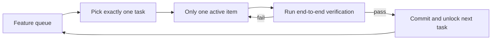

**2. Diagrama del presupuesto de razonamiento repartido según WIP (misma sección).**

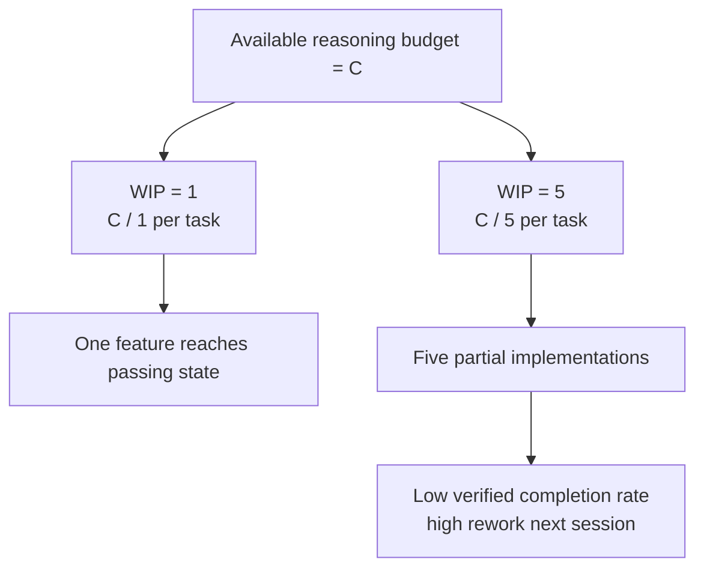

**3. Reglas de trabajo para `CLAUDE.md` / `AGENTS.md` (sección "How to Do It Right", punto 1 "Enforce WIP=1").**

```
## Work Rules
- Work on one feature at a time
- Only start the next feature after the current one passes end-to-end verification
- Don't "also refactor" feature B while implementing feature A
```

**4. Formato de entrada de feature con evidencia de completitud ejecutable (punto 2 "Define Explicit Completion Evidence for Every Task").**

```
F01: User Registration
  Verification: curl -X POST /api/register -d '{"email":"test@example.com","password":"123456"}' | jq .status == 201
  State: passing
```

### Decisiones de diseño

- **WIP=1 como valor por defecto del harness: solo una tarea en estado "active" a la vez.** Justificación matemática: con capacidad de contexto C y k tareas activas, cada tarea recibe C/k; por debajo del umbral mínimo, ninguna termina. Evidencia citada: datos experimentales de Anthropic — la estrategia "small next step" (equivalente a WIP=1) da "a 37% higher task completion rate" que prompts amplios, y las líneas de código generadas correlacionan débil y negativamente con las features realmente completadas. Caso del proyecto REST (8 features): modo sin restricciones — 5 features activadas a la vez, ~800 líneas en 12 ficheros, 20% de tests e2e pasando, 3/8 features al final de la sesión 3; modo WIP=1 — ~200 líneas en 4 ficheros, 100% e2e, 7/8 features al final de la sesión 4 (la octava bloqueada por dependencia externa). Completion rate: 87.5% vs 37.5% con menos código total (800 vs 1200 líneas).
- **Evidencia de completitud ejecutable para cada tarea.** "Done is not 'code is written' — it's 'behavior verification passes'". Cada entrada de la feature list lleva un comando de verificación; sin él, el agente sustituye "the code looks fine" por "the behavior passes tests".
- **Externalizar la "scope surface" en un fichero legible por máquina** (JSON o Markdown): un DAG de unidades de trabajo con estados limitados a `not_started, active, blocked, passing`. Justificación: cualquier sesión nueva lee el fichero y sabe de inmediato qué está activo, qué cuenta como hecho y qué verificaciones han pasado.
- **Monitorizar el VCR (Verified Completion Rate = verified tasks / activated tasks) y bloquear nuevas activaciones cuando VCR < 1.0.** Es la "completion pressure": la fuerza que el harness ejerce (vía límites WIP y evidencia de completitud) para obligar a terminar antes de empezar.
- **El overreach es un problema de harness, no de modelo.** Evidencia citada: el blog de Anthropic "Effective harnesses for long-running agents" ("when prompts are too broad, agents tend to 'start multiple things at once'"), las prácticas de Codex de OpenAI (tareas sin control de alcance ven desplomarse el completion rate), la Ley de Little (L = λW: más WIP ⇒ mayor lead time por tarea) y *Rapid Development* de McConnell (el scope creep como causa principal de fracaso de proyectos). La lección añade: los humanos tienen la intuición de "ya he hecho suficiente"; los agentes no — generar la siguiente idea les cuesta casi cero tokens.

### Anti-patrones

- **Overreach: activar más tareas de las óptimas en una sesión.** Qué es: cuantificable — "doing 5 features with 0 passing end-to-end is overreach"; el patrón de "add user registration" que deriva en 6 frentes abiertos (modelo, ruta, mail service, bcrypt, refactor de middleware, reorganización de tests), todos a medias. Por qué falla: diluye la atención (C/k), no hay verificación end-to-end y el código a medio hacer queda acoplado de forma compleja — "the next session to pick up the pieces will be completely lost". Alternativa: WIP=1 con reglas explícitas en CLAUDE.md/AGENTS.md.
- **Under-finish: código escrito sin pasar la verificación end-to-end.** Por qué falla: forma con el overreach un ciclo vicioso — "Overreach dilutes attention, diluted attention causes under-finish, and the half-finished code left behind increases system complexity, which further drives overreach in the next task". Alternativa: evidencia de completitud ejecutable + gating por VCR (no activar tareas nuevas con VCR < 1.0).
- **"Also refactor while I'm here" (scope creep incremental).** Qué es: aprovechar la tarea A para refactorizar B de paso. Por qué falla: cada modificación extra apenas cuesta tokens de generación pero diluye la atención; el scope creep es la causa principal documentada de fracaso de proyectos. Alternativa: regla explícita "Don't 'also refactor' feature B while implementing feature A"; lo relacionado va a la cola de features.
- **Aceptar "the code looks fine" como criterio de done.** Por qué falla: sin condición verificable, el agente pasa tareas a "done" sin comportamiento probado. Alternativa: "'the code looks fine' doesn't count; 'curl returns 201' does" — comandos de verificación ejecutables por entrada.
- **Mantener el alcance solo en la conversación.** Por qué falla: la sesión siguiente no puede reconstruir qué estaba activo ni qué pasó verificación. Alternativa: scope surface externalizada como fichero en el repo, "not just mentioned in conversation, but recorded in a machine-readable format".

---

## L08 — Use Feature Lists to Constrain What the Agent Does

### Plantillas literales

**1. Diagrama de la estructura triple de cada fila de feature (sección "Feature State Machine").**

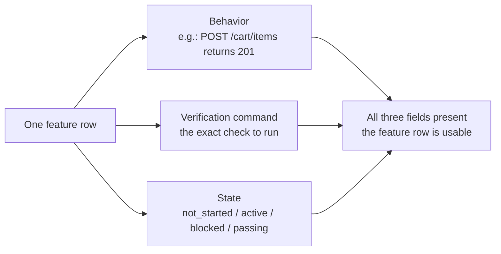

**2. Diagrama del ciclo scheduler → agente → verifier → handoff alrededor de la feature list (misma sección).**

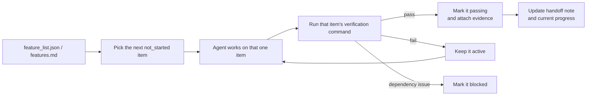

**3. Formato mínimo de entrada de feature list en JSON (sección "How to Do It", punto 1 "Define a Minimal Feature List Format").**

```json
{
  "id": "F03",
  "behavior": "POST /cart/items with {product_id, quantity} returns 201",
  "verification": "curl -X POST http://localhost:3000/api/cart/items -H 'Content-Type: application/json' -d '{\"product_id\":1,\"quantity\":2}' | jq .status == 201",
  "state": "passing",
  "evidence": "commit abc123, test output log"
}
```

**4. Reglas de feature list para `CLAUDE.md` (punto 3 "Write the Rules in CLAUDE.md").**

```
## Feature List Rules
- Feature list file: /docs/features.md
- Only one feature active at a time
- Verification command must pass before marking as passing
- Don't modify feature list states yourself — the verification script updates them automatically
```

(Nota: la lección incluye además, como contraejemplo y no como plantilla reutilizable, la nota de progreso ambigua `Did user auth, shopping cart mostly done, still need payments`.)

### Decisiones de diseño

- **La feature list es un primitivo del harness, no un memo para humanos.** Justificación: es la estructura de datos fundacional de la que dependen cuatro componentes — scheduler (elige el siguiente `not_started`), verifier (ejecuta comandos y decide transiciones), handoff reporter (genera resúmenes de traspaso) y progress tracker (métricas de salud). Analogía del texto: constraints a nivel de base de datos vs checks en la capa de aplicación — "Documents can be ignored; primitives can't be bypassed." Evidencia citada: Anthropic y OpenAI insisten en que "artifacts must be externalized" (estado de features en fichero legible por máquina, no en texto de conversación); "Building Effective Agents" de Anthropic identifica la feature list como "core data structure" para controlar el alcance del agente.
- **Estructura triple obligatoria por entrada: `(behavior description, verification command, current state)`.** Justificación: el behavior dice qué hacer, la verificación qué cuenta como hecho, el estado dónde están las cosas — "Missing any element makes the item incomplete." Sin ella, el agente aplica su estándar implícito ("the code has no obvious syntax errors") en vez de la verificación conductual end-to-end que espera el usuario ("this understanding gap persists without a feature list").
- **Máquina de estados de cuatro estados controlada por el harness: `not_started / active / blocked / passing`, con "pass-state gating".** El agente no puede cambiar estados; solo envía una solicitud de verificación, el harness ejecuta el comando y decide. La transición `active → passing` es irreversible. Justificación: hace la verificación insaltable, como una constraint de motor de base de datos.
- **La feature list como única fuente de verdad ("single source of truth") y fuente de "back-pressure".** Toda la información de "qué hay que hacer" deriva de ella, sin contradicciones con la conversación; el número de features sin pasar es la presión que el harness ejerce sobre el agente ("Zero pressure = project complete"). Evidencia: caso e-commerce con 10 features — modo memo: la sesión nueva tarda 20 min en inferir el estado y reimplementa features ya hechas; modo estructurado: en 3 min sabe que F01–F05 están `passing`, F06 `active`, F07–F10 `not_started`, y retoma F06 con cero rework. Resultado cuantificado: "45% higher feature completion rate than free-form tracking, with zero duplicate implementations"; además, "good progress records reduce session startup diagnostic time by 60-80%" (datos de ingeniería de Anthropic).
- **Calibrar la granularidad a "completable in one session".** Ejemplos del texto: "User can add items to cart" está bien; "Implement the shopping cart" es demasiado amplio; "Create the name field on the Cart model" es demasiado estrecho. Justificación: demasiado amplio no se termina; demasiado estrecho dispara el overhead de gestión.

### Anti-patrones

- **"Memo mode": tracking de progreso en notas no estructuradas.** Qué es: notas tipo "Did user auth, shopping cart mostly done, still need payments". Por qué falla: una sesión nueva no puede responder qué significa "mostly done", qué tests pasó el carrito ni qué bloquea los pagos ("The answer to all is 'nobody knows'"); resultado: 20 min infiriendo estado y reimplementación de features completadas. Alternativa: feature list estructurada con la triple (behavior, verification, state) por entrada.
- **Dejar que el agente defina "done" con su estándar implícito.** Qué es: sin lista, "done" significa para el agente "I wrote a lot of code and it looks fairly complete" / "no obvious syntax errors" (caso del e-commerce: botón de checkout que no hace nada, flujo de pago sin conectar). Por qué falla: la brecha entre ese estándar y la verificación conductual end-to-end nunca se cierra sola. Alternativa: comando de verificación explícito por feature.
- **Permitir que el agente mute los estados de la feature list.** Por qué falla: sin gating, el estado deja de reflejar la verificación real y el primitivo se degrada a documento ignorable. Alternativa: pass-state gating — solo el script/harness de verificación actualiza estados ("Don't modify feature list states yourself").
- **Múltiples fuentes de alcance contradictorias.** Qué es: requisitos implícitos en conversaciones, TODOs en el código, etc., que contradicen la lista (el ejercicio 3 lo llama auditoría del "single source principle"). Por qué falla: rompe el consenso compartido del que dependen scheduler, verifier y handoff reporter. Alternativa: unificar toda la información de alcance en la feature list como única fuente de verdad.
- **Granularidad mal calibrada.** Qué es: entradas demasiado amplias ("Implement the shopping cart") o demasiado estrechas ("Create the name field on the Cart model"). Por qué falla: "Too broad and it won't finish; too narrow and the management overhead grows." Alternativa: cada entrada dimensionada para completarse en una sesión.

---

## Síntesis L05-L08

- **Trata al agente como un ingeniero cuya memoria a corto plazo se borra cada sesión**: antes de terminar, debe dejar por escrito qué se hizo, por qué y qué sigue (PROGRESS.md, DECISIONS.md, notas de verificación, git checkpoints). El rebuild cost es la métrica clave: de ~15 min a ~3 min con buenos artefactos (L05).
- **Persiste el "why", no solo el "what"**: la compactación conserva el código pero pierde las razones de las decisiones; un decision log de tres líneas por decisión (qué, por qué, alternativa rechazada) evita que sesiones futuras deshagan decisiones deliberadas (L05).
- **Define rutinas de clock-in/clock-out en AGENTS.md/CLAUDE.md** y prepara el handoff cuando la tarea vaya a consumir más del 60% de la ventana; el context reset con artefactos completos supera a la compactación en modelos con "context anxiety", y el diseño del harness debe calibrarse al modelo concreto (L05).
- **Dedica la primera sesión solo a inicialización, sin código de negocio**: entorno ejecutable, un test de ejemplo pasando, startup readiness checklist, task breakdown con criterios de aceptación y checkpoint en git. Valídala con cuatro condiciones: can start, can test, can see progress, can pick up next steps. La inversión se recupera en 3-4 sesiones (+31% de completion rate multi-sesión) (L06).
- **Impón WIP=1 con reglas explícitas**: una sola tarea `active`, la siguiente solo se desbloquea cuando la actual pasa verificación end-to-end; prohíbe el "also refactor while I'm here". Datos: +37% de completion rate y correlación negativa entre líneas de código y features completadas (L07).
- **"Done" = comando de verificación ejecutable que pasa**, nunca "the code looks fine"; monitoriza el Verified Completion Rate y bloquea nuevas activaciones cuando VCR < 1.0 (L07).
- **Externaliza la feature list como primitivo legible por máquina** — cada entrada con la triple (behavior, verification, state), estados `not_started/active/blocked/passing`, y transiciones controladas por el harness (pass-state gating), no por el agente. Es la única fuente de verdad de la que dependen scheduler, verifier y handoff reporter (L08).
- **Calibra cada feature a "completable en una sesión"**: demasiado amplia no se termina, demasiado estrecha dispara el overhead; el tracking estructurado da +45% de completion rate y cero reimplementaciones frente a notas libres (L08).

---

## Parte 3 — Lecciones L09–L12

Resumen estructurado de las lecciones 9–12. Las plantillas y citas se reproducen verbatim en su inglés original; la prosa explicativa está en español. El contenido es agnóstico de stack salvo cuando se cita evidencia concreta de las lecciones.

---

## L09 — Preventing Agents from Declaring Victory Too Early

### Plantillas literales

**Diagrama de flujo (mermaid) — "Three-Layer Termination Check", sección "The Slippery Slope / Three-Layer Termination Check":** codifica el flujo de verificación en tres capas que debe superar cualquier declaración de "done".

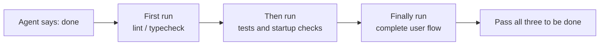

**Diagrama de flujo (mermaid) — mismo apartado:** codifica la cadena causal de la declaración prematura de victoria.

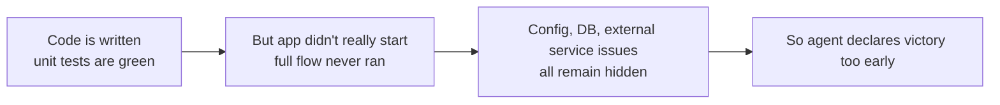

**Plantilla de CLAUDE.md — "Definition of Done", sección "1. Externalize Termination Judgment":** texto para pegar en el fichero de instrucciones del harness.

```text
## Definition of Done
- Feature complete = end-to-end verification passed, not "code is written"
- Required verification levels:
  1. Unit tests pass
  2. Integration tests pass
  3. End-to-end flow verification passes
- Do not proceed to level 2 if level 1 fails
- Do not proceed to level 3 if level 2 fails
```

**Formato de mensaje de error accionable — sección "3. Provide Actionable Error Feedback to the Agent":** ejemplo verbatim de cómo redactar errores para agentes (no usar `"Test failed"`, sino):

```text
Test failed: POST /api/reset-password returned 500. Check that the email service config exists in environment variables. The template file should be at templates/reset-email.html.
```

### Decisiones de diseño

1. **Externalizar el juicio de terminación fuera del agente.** El harness ejecuta la validación de terminación de forma independiente, usando señales de runtime en lugar de la confianza autoinformada del agente. Justificación citada: el paper de Guo et al. (ICML 2017) demuestra que "modern neural networks are systematically overconfident", y la investigación de Anthropic (2026) encontró que "when an agent is asked to evaluate its own work, it systematically provides overly positive assessments—even when a human observer would judge the quality as clearly substandard."
2. **Validación de terminación en tres capas** (sintaxis/estática → comportamiento en runtime → confirmación a nivel de sistema), sin atajos entre capas. Justificación: cada capa detecta lo que la anterior no puede; "el código parece bien" no es evidencia de "la funcionalidad está completa". En el caso real de la lección (password reset), la intervención del harness descubrió todos los defectos dentro de la sesión "saving 5-10x the cost of post-hoc fixes".
3. **Separar el "worker" del "checker": agente evaluador independiente y "nitpicky".** No intentar hacer al agente "más objetivo" — el mismo modelo genera y evalúa, así que es inherentemente generoso consigo mismo. Evidencia experimental de Anthropic (mismo modelo Opus 4.5, mismo prompt "build a 2D retro game editor"):

   | Architecture | Runtime | Cost | Core Features Working? |
   |--------------|---------|------|------------------------|
   | Single agent (bare run) | 20 mins | $9 | No (game entities unresponsive to input) |
   | Three agents (planner + generator + evaluator) | 6 hours | $200 | Yes (game is fully playable) |

4. **Mensajes de error con instrucciones de reparación** (patrón de OpenAI/Codex): "error messages written for agents should include repair instructions". Justificación: feedback específico y accionable permite al agente autocorregirse sin intervención humana.
5. **Constraint de prioridad de completitud:** primero corrección funcional, luego rendimiento, al final estilo; prohibido refactorizar antes de verificar la funcionalidad núcleo. Justificación: la refactorización "shifts the boundary between verified and unverified code, potentially breaking code paths that were previously implicitly correct."
6. **Capturar señales de runtime como base objetiva del juicio de completitud:** ¿arrancó la app y llegó a estado ready?, ¿se ejecutaron los caminos críticos?, ¿fueron correctos los efectos secundarios (BD, ficheros)?, ¿se limpiaron recursos temporales?

### Anti-patrones

- **"Passing unit tests = task complete."** Qué es: el agente ve tests unitarios en verde y declara "done". Por qué falla: el aislamiento con mocks es precisamente lo que hace a los tests unitarios incapaces de detectar problemas entre componentes (interface mismatch, errores de propagación de estado, dependencias de entorno). Alternativa: los tres niveles de verificación son obligatorios; pasar unit tests es solo el nivel 1.
- **"Refactoring while we're at it" antes de verificar.** Qué es: el agente refactoriza, optimiza y mejora estilo antes de que la funcionalidad núcleo pase verificación. Por qué falla: mueve la frontera entre código verificado y no verificado y puede romper caminos implícitamente correctos. Alternativa: Completion Priority Constraint — no refactorizar hasta verificar el núcleo.
- **Autoevaluación por el agente generador.** Qué es: el mismo agente que escribió el código juzga si está terminado. Por qué falla: sesgo de calibración de confianza sistemáticamente positivo, especialmente severo en tareas subjetivas. Alternativa: evaluador independiente "nitpicky" (arquitectura planner + generator + evaluator con testing real, p. ej. clicks con Playwright).
- **Mensajes de error que solo dicen "it's wrong".** Qué es: feedback tipo `"Test failed"` sin contexto. Por qué falla: el agente no puede autocorregirse y reintenta a ciegas. Alternativa: errores con qué falló, dónde, y cómo repararlo.

---

## L10 — Only a Full Pipeline Run Counts as Real Verification

### Plantillas literales

**Diagrama (mermaid) — "Testing Pyramid and Review Feedback Promotion":** contrasta lo que ven los unit tests aislados frente al recorrido real del sistema en E2E.

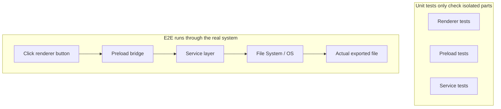

**Diagrama (mermaid) — flujo de "Review Feedback Promotion":** codifica el proceso de convertir comentarios de review en checks permanentes del harness.

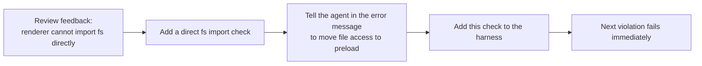

**Plantilla de jerarquía de validación — sección "1. The Harness Must Include an End-to-End Layer":**

```text
## Validation Hierarchy
- Level 1: Unit tests (Must pass)
- Level 2: Integration tests (Must pass)
- Level 3: End-to-end tests (Must pass when cross-component changes are involved)
- Skipping any required level = Not Complete
```

**Check ejecutable de regla arquitectónica — sección "2. Turn Architectural Rules into Executable Checks":**

```bash
# Check whether the renderer process directly calls Node.js APIs
grep -r "require('fs')" src/renderer/ && exit 1 || echo "OK: no direct fs access in renderer"
```

**Formato de mensaje de error para agentes (qué / por qué / cómo arreglar) — sección "3. Design Agent-Oriented Error Messages":**

```text
ERROR: Found direct import of 'fs' in src/renderer/App.tsx:12
WHY: Renderer process has no access to Node.js APIs for security
FIX: Move file operations to src/preload/file-ops.ts and call via window.api.readFile()
```

**Ejemplo verbatim de mensaje de error con instrucción de reparación (patrón OpenAI/Codex), sección "Testing Pyramid and Review Feedback Promotion":** en lugar de `"Direct filesystem access in renderer"`, escribir:

```text
Direct filesystem access in renderer. All file operations must go through the preload bridge. Move this call to preload/file-ops.ts and invoke it via window.api.
```

### Decisiones de diseño

1. **El harness debe incluir una capa E2E obligatoria para cambios cross-componente.** Justificación con evidencia del caso real (feature de exportación de ficheros en una app Electron): 5 defectos de frontera entre componentes (interface mismatch, propagación de estado por IPC, fuga de recursos, permisos en entorno empaquetado, propagación de errores) — "All 5 defects were caught by end-to-end tests; unit tests caught none." Coste asumido: el tiempo de test subió de 2 s a 15 s, "perfectly acceptable in an agent workflow".
2. **E2E cambia el comportamiento del agente, no solo los resultados.** Cuando el agente sabe que habrá validación E2E, considera interacciones entre componentes, respeta fronteras arquitectónicas y maneja caminos de error. Es una decisión de diseño del harness que moldea cómo se escribe el código.
3. **Definir fronteras arquitectónicas ANTES de escribir E2E, desde el día uno.** Experiencia de OpenAI: "for agent-generated codebases, architectural constraints must be established as early prerequisites on day one — not something to think about once the team has grown", porque "agents copy existing patterns in the repository, even when those patterns are inconsistent or suboptimal". Ejemplo citado: la "Layered Domain Architecture" de OpenAI (Types -> Config -> Repo -> Service -> Runtime -> UI, dependencias estrictamente hacia delante, cross-domain solo vía Providers, todo forzado con linting a medida).
4. **"Enforce invariants; don't micromanage implementation."** Exigir p. ej. que "data is parsed at the boundary" sin prescribir qué librería usar. Justificación: las reglas deben ser mecánicas y comprobables sin sobre-restringir al agente.
5. **Reglas arquitectónicas como checks ejecutables, no documentos.** De "written on paper" a "running in CI": cada constraint del documento de arquitectura debe tener un test o regla de lint correspondiente.
6. **Review Feedback Promotion como proceso permanente.** Cada categoría de error recurrente detectada en code review se convierte en check automático: "A month later your harness will be far stronger than it was at the start of the month."

### Anti-patrones

- **Quedarse en la base de la pirámide de testing.** Qué es: solo unit tests (el agente tiende a ejecutar únicamente los tests más rápidos y declarar completitud). Por qué falla: los unit tests son sistemáticamente ciegos a defectos de frontera entre componentes por su diseño de aislamiento con mocks (interface mismatch, propagación de estado, ciclo de vida de recursos, dependencias de entorno). Alternativa: gradiente de suficiencia de testing — la jerarquía de validación con E2E obligatorio en cambios cross-componente.
- **E2E sobre una arquitectura sin fronteras claras.** Qué es: hacer E2E cuando "the architecture is a tangled mess". Por qué falla: el E2E solo demuestra que "the whole mess runs" sin revelar dónde se violó la intención de diseño. Alternativa: establecer y automatizar constraints arquitectónicos como prerrequisito (paso 0).
- **Reglas arquitectónicas solo en documentos.** Qué es: constraints escritos "esperando a que alguien los lea". Por qué falla: los agentes copian patrones existentes del repo y cada sesión sin constraints introduce más drift. Alternativa: convertir cada regla en check ejecutable en CI con mensaje de error accionable.
- **Mensajes de fallo sin instrucciones de arreglo.** Qué es: p. ej. `"Direct filesystem access in renderer"` a secas. Por qué falla: no cierra el bucle de autocorrección. Alternativa: formato ERROR/WHY/FIX con pasos concretos.
- **Dejar que los mismos errores reaparezcan en cada review.** Qué es: corregir en review el mismo tipo de fallo una y otra vez sin capturarlo. Por qué falla: el conocimiento se pierde y el harness no mejora. Alternativa: Review Feedback Promotion — cada categoría capturada se vuelve "a permanent line of defense".

---

## L11 — Making the Agent's Runtime Observable

### Plantillas literales

**Diagrama (mermaid) — "Layered Observability":** codifica el bucle contrato → generación → señales → revisión → veredicto → generador.

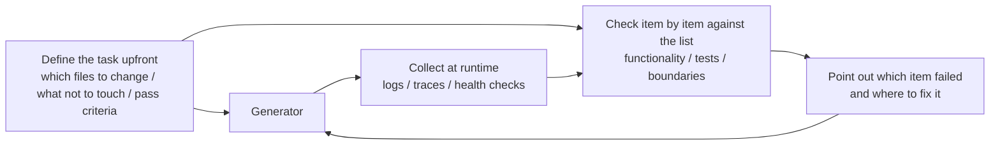

**Plantilla de Sprint Contract — sección "2. Implement Sprint Contracts":**

```markdown
# Sprint Contract: Dark Mode Support

## Scope
- Modify the theme toggle component
- Update global CSS variables
- Add dark mode tests

## Verification Standards
- Visual regression tests pass for each component
- Main flow end-to-end tests pass
- No flash of unstyled content (FOUC)

## Exclusions
- Not handling print styles
- Not handling third-party component dark mode
```

**Plantilla de rúbrica de evaluación — sección "3. Establish an Evaluator Rubric":**

```markdown
# Scoring Rubric

| Dimension | A | B | C | D |
|-----------|---|---|---|---|
| Code correctness | All tests pass | Main flow passes | Partial pass | Build fails |
| Architecture compliance | Fully compliant | Minor deviations | Obvious deviations | Serious violations |
| Test coverage | Main + edge cases | Main flow only | Only skeleton | No tests |
```

### Decisiones de diseño

1. **La observabilidad es una propiedad arquitectónica del harness, no un añadido posterior.** Justificación: sin ella, "agents make decisions under uncertainty, evaluations become subjective judgments, and retries become blind wandering". Evidencia del escenario dark-mode: sin observabilidad, 3-4 ciclos ciegos y ~45 min para un resultado apenas aceptable; con observabilidad completa, 1 iteración y ~15 min — "3x efficiency difference. The only variable is observability."
2. **Observabilidad en dos capas, ambas imprescindibles.** Runtime observability (logs, traces, eventos de proceso, health checks — "what did the system do") + process observability (planes, rúbricas, criterios de aceptación — "why should this change be accepted"). Justificación: las señales de runtime explican el comportamiento; los artefactos de proceso explican la intención.
3. **La recolección de señales debe estar en el harness, no delegada al agente.** Justificación argumentada en "Why Agents Can't Solve This Themselves": (1) "Agents don't know what they don't know" — solo loguean lo que creen importante, y no basta; (2) formatos de log inconsistentes entre sesiones impiden análisis sistemático; (3) la observabilidad de proceso (contratos, rúbricas) requiere soporte estructurado del harness, no prints. Señales a recolectar automáticamente: ciclo de vida de la aplicación, ejecución de caminos críticos, flujo de datos entre componentes, uso anómalo de recursos, contexto completo de errores.
4. **Sprint contracts negociados antes de codificar.** Acuerdo corto que fija alcance, estándares de verificación y exclusiones. Justificación: "Sprint contracts front-load alignment" — evitan que el generador construya algo que el evaluador rechazará por razones previsibles.
5. **Rúbricas de evaluación para hacer la evaluación reproducible.** Justificación: sin rúbrica, "the same output can get wildly different assessments from different evaluators"; con rúbrica, el feedback cita evidencia concreta, p. ej.: "Button color contrast is insufficient (WCAG AA standard 4.5:1, measured 2.1:1)."
6. **Estandarizar trazas con OpenTelemetry.** Una trace por sesión de harness, un span por tarea, sub-spans por paso de verificación, atributos estándar — para integrarse con toolchains existentes (Jaeger, Zipkin).
7. **El planner debe restringir entregables, no detalles técnicos.** En el experimento de Anthropic (DAW con Web Audio API, marzo 2026), el planner fue instruido para "be bold in scope" y "focus on product context and high-level technical design rather than detailed technical implementation", porque los errores de detalle técnico prematuro "cascade downstream". Datos del experimento: total 3 hr 50 min y $124.70, con desglose por fases (Planner 4.7 min/$0.46; Build 1: 2 h 7 min/$71.08; QA 1: 8.8 min/$3.24; Build 2: 1 h 2 min/$36.89; QA 2: 6.8 min/$3.09; Build 3: 10.9 min/$5.88; QA 3: 9.6 min/$4.06).
8. **Iterar el prompt del evaluador leyendo sus logs.** Las primeras versiones del evaluador de Anthropic identificaban problemas razonables y luego "talk themselves into dismissing those issues as not severe". El fix: leer los logs del evaluador, localizar dónde su juicio divergía del humano, y actualizar el prompt de QA para esos puntos concretos.

### Anti-patrones

- **Ejecución a ciegas ("done, but two tests are failing... not sure, might be a timing issue").** Qué es: el agente trabaja sin visibilidad del estado real de runtime. Por qué falla: cada decisión es una conjetura; no se distingue "correct" de "looks correct" (el code review muestra "what was written", solo el tracing muestra "what actually ran"). Alternativa: señales de runtime recolectadas por el harness.
- **Evaluación como misticismo.** Qué es: evaluar calidad sin rúbrica ni criterios de aceptación, con juicios tipo "it doesn't feel right". Por qué falla: evaluaciones no reproducibles y rechazos que el generador no puede accionar, provocando reintentos ciegos. Alternativa: evaluator rubric con dimensiones, niveles y evidencia medible.
- **Reintentos a ciegas.** Qué es: reintentar sin saber por qué falló lo anterior. Por qué falla: "It might hammer away in the wrong direction... Every blind retry burns tokens and time." Alternativa: veredictos que señalan qué ítem del contrato falló y dónde arreglarlo.
- **Handoff de sesión sin artefactos ("information cliff").** Qué es: pasar trabajo incompleto a la siguiente sesión sin registro observable. Por qué falla: la nueva sesión rediagnostica desde cero — según observaciones de Anthropic, "this redundant diagnosis can eat up 30-50% of total session time". Alternativa: task traces y artefactos de proceso (contratos, rúbricas, progreso).
- **Confiar en que el agente se loguee a sí mismo.** Qué es: "Can't the agent just print its own logs?". Por qué falla: no sabe qué señales necesitará, los formatos divergen entre sesiones, y los artefactos de proceso no son logs. Alternativa: observabilidad construida en el harness.
- **Evaluador que se auto-convence de aprobar.** Qué es: el evaluador detecta problemas y luego los descarta como "no severos". Por qué falla: aprueba trabajo con funcionalidad núcleo solo "presentational". Alternativa: umbrales duros por dimensión ("if any falls short, the sprint fails") y bucle de mejora del prompt del evaluador basado en sus logs.

---

## L12 — Leave a Clean Handoff at the End of Every Session

### Plantillas literales

**Diagrama (mermaid) — flujo de salida limpia de sesión, sección "Clean State: More Than 'The Code Compiles'":**

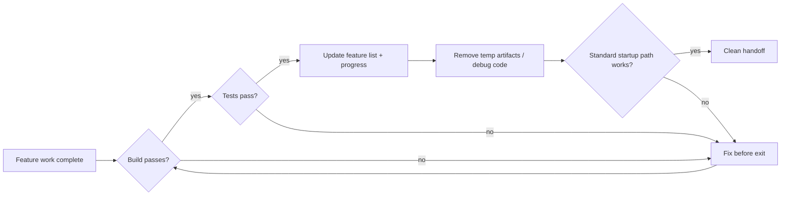

**Diagrama (mermaid) — bucles de entropía sucio vs. limpio, misma sección:**

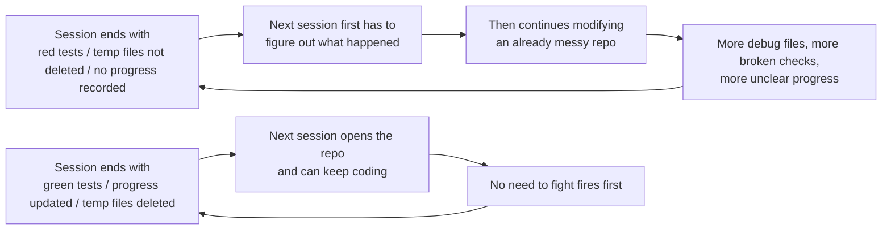

**Checklist de salida de sesión (para CLAUDE.md) — sección "1. Clean State Is a Necessary Condition for Completion":**

```text
## Session Exit Checklist
- [ ] Build passes (npm run build)
- [ ] All tests pass (npm test)
- [ ] Feature list updated
- [ ] No debug code remaining (console.log, debugger, TODO)
- [ ] Standard startup path available (npm run dev)
```

**Plantilla de Quality Document — sección "3. Maintain a Quality Document":**

```markdown
# Quality Document

## User Authentication Module (Quality: A)
- Verification passing: Yes
- Agent understandable: Yes
- Test stability: Stable
- Architecture boundaries: Compliant
- Code conventions: Followed

## Payment Module (Quality: C)
- Verification passing: Partial (payment callback untested)
- Agent understandable: Difficult (logic spread across 3 files)
- Test stability: Unstable (2 flaky tests)
- Architecture boundaries: Violations present
- Code conventions: Partially followed
```

**Script de limpieza idempotente — sección "5. Cleanup Operations Must Be Idempotent":**

```bash
# Idempotent cleanup operations
rm -f /tmp/debug-*.log  # -f ensures no error when files don't exist
git checkout -- .env.local  # Restore to known state
npm run test  # Verify cleanup didn't break anything
```

### Decisiones de diseño

1. **Clean state como condición necesaria de completitud: "session completion = task passes verification AND clean state check passes."** Cinco dimensiones no negociables: build pasa, tests pasan, progreso registrado, sin artefactos obsoletos, ruta de arranque estándar funcional. Justificación: las leyes de Lehman (la complejidad crece salvo gestión activa) y la evidencia del caso de 12 semanas: sin estrategia de limpieza, el build pass rate cayó de 100% a 68%, tests de 100% a 61% y el arranque de sesión de 5 min a 60+ min; con estrategia, 97%/95%/9 min — "build pass rate differs by 29 percentage points, new session startup time differs by 85%". Coste: ~5 min extra por sesión, que "over 12 weeks that saved dozens of hours of chaos".
2. **Registrar el progreso en artefactos legibles por máquina** (subtareas completadas con criterios de paso, en curso con estado actual, no empezadas). Justificación: "Good progress records can reduce session startup diagnostic time by 60–80%."
3. **Estrategia de limpieza dual:** inmediata al final de cada sesión (artefactos temporales, feature list, build y tests verdes — limpieza tipo "reference counting") + periódica semanal (escaneo estructural, quality documents, benchmarks para detectar drift — limpieza tipo "tracing").
4. **Codificar "golden rules" en el repositorio y automatizar la limpieza** (experiencia de OpenAI con Codex): reglas concretas y mecánicamente comprobables como "prefer the shared utility package over hand-rolled ad-hoc helpers" y "don't YOLO-guess data structures"; flota de tareas Codex en background que escanean desviaciones, actualizan quality scores y abren PRs de refactor "reviewed and auto-merged within a minute"; y "Capture human taste once, enforce it continuously" — comentarios de review, PRs de refactor y bugs se traducen a documentación o tooling, y "When documentation isn't enough, promote the rule into code." Justificación: OpenAI gastaba el 20% de cada viernes limpiando "AI slop" manualmente, lo cual no escala; los agentes copian patrones existentes aunque sean subóptimos, produciendo drift.
5. **Quality document como artefacto vivo** que puntúa cada módulo continuamente. Justificación: hace rastreable la salud del codebase ("you can only proactively fix what you know is degrading") y da a las sesiones nuevas una prioridad inmediata: "Fix the lowest-scoring module first."
6. **Simplificar el harness periódicamente** — cada componente existe porque el modelo no podía hacer algo de forma fiable, y esos supuestos caducan. Práctica recomendada: cada mes deshabilitar temporalmente un componente y correr benchmarks; si no hay degradación, eliminarlo. Evidencia de Anthropic: el mecanismo de sprint-splitting era necesario con Sonnet 4.5 pero con Opus 4.6 era "unnecessary overhead"; tras eliminarlo, "the builder agent could work continuously for over two hours without drifting". En cambio, el evaluador seguía aportando valor en tareas cerca de la frontera de capacidad del modelo — la decisión no es fija, "it depends on where task difficulty sits relative to model capability". Principio profundo: "as models improve, the interesting combinations in a harness don't shrink — they shift."
7. **Operaciones de limpieza idempotentes.** Justificación: deben poder ejecutarse repetidamente sin efectos secundarios, para seguir siendo seguras en escenarios de fallo-reintento.
8. **Con alto throughput de agentes, minimizar los merge gates bloqueantes.** Experiencia de OpenAI con ~3.5 PRs/día por agente: PRs de vida corta, flakiness de tests resuelta con re-runs en vez de bloquear indefinidamente. Criterio de decisión explícito: "average cost of fixing a bug vs. average cost of waiting for a human to review a PR" — cuando lo primero es menor, el merge rápido es correcto. Caveat citado por la lección: "This is irresponsible in a low-throughput environment."
9. **Integridad de sesión tipo transacción:** "either fully commit and leave a clean state, or roll back to the last consistent state. No middle ground."

### Anti-patrones

- **"Clean up later" / limpieza diferida.** Qué es: "no time to clean up this session, I'll do it next time". Por qué falla: la siguiente sesión no sabe qué quedó atrás, tiene sus propios objetivos, ignora el caos y construye encima — "This is entropy's positive feedback loop"; la degradación medida en 12 semanas (68% build, 61% tests, 60+ min de arranque) lo cuantifica. Alternativa: clean state obligatorio en cada salida de sesión + cleanup loop semanal.
- **Equiparar clean state con "el código compila".** Qué es: considerar suficiente que el build pase. Por qué falla: omite tests preexistentes rotos, progreso sin registrar, artefactos temporales (debug logs, código comentado, TODOs) que "increase cognitive load for the next session", y rutas de arranque rotas. Alternativa: las cinco dimensiones verificadas explícitamente, y en CI, no "works on my machine".
- **Limpieza manual heroica.** Qué es: dedicar tiempo humano recurrente a limpiar "AI slop" (el 20% de los viernes del equipo de OpenAI). Por qué falla: "this approach clearly doesn't scale". Alternativa: golden rules en el repo + tareas automáticas de limpieza en background + promoción de gusto humano a tooling/código.
- **Dejar patrones malos en el repo.** Qué es: tolerar inconsistencias porque "ya está sucio". Por qué falla: "agents copy patterns already present in the repository, even when those patterns are inconsistent or suboptimal" — la analogía de las tazas de café: el desorden atrae más desorden. Alternativa: pagar la deuda técnica en incrementos pequeños y continuos ("Technical debt is a high-interest loan").
- **Harness fosilizado.** Qué es: mantener componentes del harness indefinidamente aunque el modelo ya no los necesite. Por qué falla: se convierten en "unnecessary overhead" (caso del sprint-splitting con Opus 4.6). Alternativa: revisión mensual con benchmark — deshabilitar, medir, eliminar/restaurar/sustituir por algo más ligero.
- **Merge gates bloqueantes en entornos de alto throughput.** Qué es: aplicar la filosofía tradicional de review lento cuando el output del agente excede la capacidad de revisión humana. Por qué falla: el coste de esperar supera el coste de arreglar. Alternativa: PRs cortos y merges rápidos con fixes rápidos — solo cuando el criterio de costes lo justifica.

---

## Síntesis L09-L12

- **Externalizar el "done":** el harness, no el agente, decide la completitud, con señales de runtime y una jerarquía de verificación en tres niveles (lint/estática → tests+arranque → flujo E2E completo) que no admite saltos entre capas.
- **Separar worker y checker:** un evaluador independiente y exigente (con testing real de la app, rúbricas por dimensión y umbrales duros) transforma resultados — misma tarea y modelo, de "no funciona" ($9) a "totalmente jugable" ($200) en el experimento de Anthropic.
- **Todo mensaje de error dirigido a un agente debe incluir qué falló, por qué y cómo arreglarlo** (formato ERROR/WHY/FIX): convierte los fallos de verificación en un bucle de autocorrección sin humano.
- **Reglas arquitectónicas como checks ejecutables desde el día uno**, con Review Feedback Promotion: cada categoría de error recurrente de review se convierte en check automático permanente; el harness se fortalece solo.
- **Observabilidad en dos capas construida en el harness:** señales de runtime (qué hizo el sistema) + artefactos de proceso (sprint contracts y rúbricas: por qué aceptar el cambio); su ausencia cuesta 30-50% del tiempo de sesión en rediagnóstico y multiplica ~3x la duración de la iteración.
- **Clean state como parte de la definición de done:** cinco dimensiones (build, tests, progreso registrado, sin artefactos temporales, arranque funcional) verificadas al salir de cada sesión; ~5 min/sesión evitan una degradación medida de 29 puntos en build pass rate y 85% en tiempo de arranque a 12 semanas.
- **Mantener artefactos vivos entre sesiones:** progreso legible por máquina (−60-80% de tiempo de diagnóstico al arrancar) y un quality document por módulo que dice a la sesión nueva dónde priorizar.
- **Podar el harness periódicamente:** cada mes deshabilitar un componente, correr benchmarks y eliminarlo si no hay degradación — los supuestos sobre lo que el modelo no puede hacer caducan, y las combinaciones valiosas del harness se desplazan en lugar de desaparecer.

